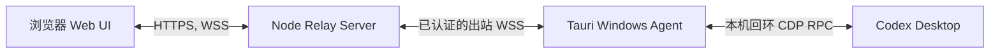

# Codex Remote Bridge

[English README](README.md)

Codex Remote Bridge 是一个面向 Codex Desktop 的浏览器远程控制界面。它让网页、Windows
桌面 Agent 与本机 Codex Desktop 保持实时同步，使手机或其他浏览器能够查看并控制同一份
Codex 任务。

## 二次开发说明

本项目基于 [friuns2/codex-mobile](https://github.com/friuns2/codex-mobile) 进行二次开发，
保留了其 Vue 网页界面与 Codex app-server 工作流能力。上游项目同时注明其基础来自
[pavel-voronin/codex-web-local](https://github.com/pavel-voronin/codex-web-local)。请遵守
[LICENSE](LICENSE) 中的许可协议。

## 架构



Agent 主动连接公网 Relay，手机不会直接连接用户电脑，也不需要在路由器或电脑上开放入站端口。

## 保留的原有功能

- 基于 Vue 的 Codex app-server 网页界面，支持项目与任务浏览。
- 聊天消息、助手回复、推理摘要、命令输出、文件变更、计划、审批与任务状态展示。
- 新建、搜索、重命名、归档、分叉、回滚、排队、停止任务与终端工作流。
- 模型、推理强度、协作模式、模型提供商、技能、MCP 与自动化页面。
- 桌面与移动端响应式布局，图片和文件上下文，语音输入与本地文件浏览。
- 项目 ZIP 导出/导入，以及 Codex 会话历史迁移。
- 可选 Telegram 机器人桥接，以及反向代理、隧道和 Tailscale 类私有访问支持。

## 本项目新增功能

- Windows 托盘程序 **Codex Bridge Agent**，基于 Tauri 构建。
- 通过 CDP 直接调用 Codex Desktop 内部 AppServerManager；生产链路不模拟全局鼠标或键盘。
- 已认证的设备中继协议，支持请求/响应转发、实时事件流、心跳、重连、消息大小限制与幂等请求。
- 每台电脑独立的 `deviceId` 与配对令牌。网页 RPC、WebSocket 与 SSE 都按所选电脑路由。
- 公网二维码访问链接：`https://你的域名/#/device/<deviceId>`。二维码不包含配对令牌和局域网地址。
- Codex Desktop 与网页之间双向同步：用户消息、助手输出、推理活动、命令执行、文件变更、运行中任务与停止操作。
- 网页消息立即乐观显示，执行状态同步显示，并使用真实的 `turn/interrupt` 停止任务。
- Agent 配置、连接诊断、自动重连、开机启动，以及 Windows Credential Manager 令牌存储。

## 环境要求

- Web 与 Relay：Node.js 18+、pnpm。
- 构建 Tauri Agent：Windows、Rust stable、MSVC 构建工具和 WebView2 Runtime。
- 每台受控电脑：已运行并已登录的官方 Codex Desktop。
- 公网部署：必须使用 HTTPS/WSS。

## 本地开发

```bash
pnpm install
pnpm run build
node dist-cli/index.js --port 5900 --no-open --no-tunnel --no-login
```

构建 Windows Agent：

```bash
pnpm run build:agent
pnpm run package:agent
```

安装包输出目录：

```text
apps/desktop-agent/src-tauri/target/release/bundle/nsis/
```

Agent 配置、协议、配对、安全边界和测试方式请阅读
[documentation/DESKTOP_AGENT.md](documentation/DESKTOP_AGENT.md)。

## 安全与发布边界

`deviceId` 只用于路由，不是访问密钥。配对令牌仅保存在用户电脑的 Windows Credential
Manager 中，服务端只能保存其摘要。

当前实现已经具备设备隔离和 Agent 令牌认证。若对公网开放给多用户使用，还必须补充普通用户
登录，并在每个 RPC 与事件订阅中强制执行持久化的 `userId -> deviceId` 所有权校验。公网环境
不得使用明文 HTTP，也不得关闭认证。

## 验证

```bash
pnpm vitest run
pnpm run build
cargo test --manifest-path apps/desktop-agent/src-tauri/Cargo.toml
```
