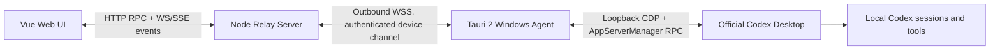

# Codex Desktop Tauri Bridge 功能与部署文档

## 1. 目标

该功能将浏览器端作为 Codex Desktop 的远程控制界面。网页和 Desktop 共享同一份任务、消息、执行状态与停止操作：

- 网页发送消息时，由用户电脑上的 Tauri Agent 调用 Codex Desktop 内部 AppServerManager。
- Desktop 产生的用户消息、助手增量、分析摘要、命令输出、文件变更和完成状态实时回传网页。
- 网页点击停止时，Agent 调用真实 `turn/interrupt`，不模拟按钮点击。
- 服务器不读取用户电脑文件，也不保存 Codex 登录凭据。
- 每台电脑使用独立 `deviceId` 和配对令牌，可通过同一服务器连接。
- Agent 默认展示公网访问二维码，手机可通过任意网络进入对应电脑的远程页面。

## 2. 架构



服务器发布到公网后，浏览器只连接服务器；Tauri Agent 从每台用户电脑主动向服务器建立出站 WSS，因此不需要在用户电脑开放入站端口。

手机二维码链接由固定公网 Web 地址和机器码组成：

```text
https://codex.example.com/#/device/desktop-a
```

`deviceId` 只负责找到对应 Agent 长连接，不是访问凭据。二维码不包含配对令牌，也不包含局域网地址。

## 3. 前端功能

前端继续使用现有接口，不需要感知 CDP：

- `POST /codex-api/rpc`：读取任务、发送消息、停止任务及其他 App Server RPC。
- `GET /codex-api/events` 和 `WS /codex-api/ws`：接收实时事件。
- `GET /codex-api/desktop-bridge/status`：读取 Agent 设备在线状态。

关键交互：

1. `turn/start` 成功后，用户消息立即进入消息列表。
2. 收到 `turn/started`、`item/started`、增量事件时显示执行中状态。
3. 执行中，发送按钮切换为 `Stop`。
4. 点击 `Stop` 后发送真实 `turn/interrupt`。
5. 收到 `turn/completed` 或中断事件后恢复发送按钮。
6. Desktop 发起的任务通过 Agent 事件流自动刷新到网页。

## 4. Node 服务端

### 4.1 Agent 模式

启动变量：

```powershell
$env:CODEXUI_DESKTOP_DRIVER = "agent"
$env:CODEXUI_AGENT_PAIRING_TOKEN = "replace-with-a-random-token"
node dist-cli/index.js --port 5900 --no-open --no-tunnel
```

`agent` 模式不会安装或启动服务器本机的 Codex CLI。所有 App Server RPC 都路由到已配对的电脑。

服务器接受 Agent 连接的地址：

```text
WS  /codex-api/agent/ws
WSS /codex-api/agent/ws
```

远程部署必须使用 HTTPS/WSS。只有 `localhost`、`127.0.0.0/8` 和 `::1` 允许明文 HTTP/WS。

### 4.2 每设备令牌

单机测试可以使用 `CODEXUI_AGENT_PAIRING_TOKEN`。多人部署应使用设备令牌映射：

```powershell
$env:CODEXUI_AGENT_TOKENS_JSON = '{"desktop-a":"sha256:<64位十六进制摘要>","desktop-b":"sha256:<64位十六进制摘要>"}'
```

服务端只保存令牌的 SHA-256 摘要，并使用常量时间比较。令牌应至少包含 32 字节随机数据。

可使用 Node.js 生成随机令牌和服务端摘要：

```powershell
$env:CODEX_AGENT_TOKEN = node -e "process.stdout.write(require('crypto').randomBytes(32).toString('base64url'))"
node -e "process.stdout.write('sha256:' + require('crypto').createHash('sha256').update(process.env.CODEX_AGENT_TOKEN).digest('hex'))"
```

原始令牌只填写到对应电脑的 Agent 设置中；服务器配置和数据库仅保存第二条命令输出的 `sha256:<hex>`。

路由规则：

- 只有一台 Agent 在线时自动选择该设备。
- 扫描 `#/device/:deviceId` 后，Vue 在首批 RPC 前保存当前机器选择。
- 网页在每个 `POST /codex-api/rpc` 请求的顶层 `deviceId` 字段指定设备。
- `__codexWebBridge.deviceId` 继续作为旧客户端兼容回退，不再是新网页的主要路由入口。
- 也可使用服务器变量 `CODEXUI_AGENT_DEVICE_ID` 设置默认设备。
- `turn/interrupt` 会优先路由到创建该 `turnId` 的设备。
- Agent 事件始终携带来源 `deviceId`。WebSocket/SSE 可通过 `?deviceId=desktop-a` 订阅指定设备。
- 未指定设备时，只转发当前唯一在线设备或 `CODEXUI_AGENT_DEVICE_ID` 指定设备的事件；多设备且无默认值时不转发设备事件，避免状态串线。

当前实现提供设备隔离与令牌认证；正式多租户发布仍需在上层增加用户登录，以及 `userId -> deviceId` 授权关系。

### 4.3 Agent 协议

Agent 协议版本为 `1`，包含：

- `hello` / `hello/ack`：设备认证和能力协商。
- `request` / `response`：RPC 请求与响应。
- `response/chunk`：大响应分片。
- `event`：Desktop 实时事件。
- `ping` / `pong`：应用层心跳。

限制：

- 单帧最大 1 MiB。
- 大响应按 512 KiB 分片，重组上限 256 MiB。
- 请求 ID 支持幂等缓存；重复的进行中请求只执行一次。已完成响应缓存最多 512 项、总计 16 MiB、保留 5 分钟，超预算响应正常发送但不缓存。
- 未认证连接必须在 10 秒内完成 `hello`，每个服务进程最多保留 64 个待认证连接。
- Agent 断线后按 1、2、5、10、30 秒退避重连。
- 长错误消息按 JavaScript UTF-16 长度限制为 1000，避免协议拒绝和连接重置。

## 5. Tauri Windows Agent

代码目录：

```text
apps/desktop-agent/
```

功能：

- Windows 托盘常驻。
- 默认窗口只显示云端/Desktop 状态、设备访问二维码、公网地址、复制和本机打开操作。
- 扫码地址格式为 `<webUrl>#/device/<deviceId>`，二维码由 Agent 在本地生成，不请求第三方二维码服务。
- 服务器、网页地址、设备身份、令牌和开机启动集中在二级“连接设置”中。
- 设置服务器地址、网页地址、设备 ID、设备名称和配对令牌。
- 打开网页、打开设置、立即重连、切换开机启动、退出。
- 单实例运行；重复启动只唤起设置窗口。
- 使用 Windows Credential Manager 保存令牌。
- 普通配置原子写入：

```text
%APPDATA%\ai.openai.codex.bridge.agent\agent-config.json
```

配置 JSON 不包含配对令牌。

### 5.1 CDP Bridge

Agent 只使用 CDP 进行内部协议调用：

1. 只接受官方安装路径 `WindowsApps\OpenAI.Codex_*\app\ChatGPT.exe`。
2. 从官方进程命令行读取远程调试端口。
3. 只连接 `127.0.0.1`，并要求目标 URL 精确为 `app://-/index.html`。
4. 在 renderer 中定位本地 `AppServerManager`。
5. 通过 `manager.sendRequest()` 调用真实 App Server RPC。
6. 订阅任务、消息、分析、命令、文件变更和完成事件。

进程发现使用隐藏 PowerShell 查询 Win32 进程信息，但不会操作 UI。生产代码不包含：

- `SendKeys`
- `SetForegroundWindow`
- 鼠标事件
- 剪贴板注入
- DOM `.click()` 发送

Codex Desktop 未公开该内部 renderer 合约。Desktop 升级后如果 React/AppServerManager 结构变化，Agent 会进入错误状态并持续重连，而不会回退到全局输入模拟。

## 6. 构建和打包

依赖：

- Node.js 18+
- pnpm
- Rust stable + MSVC Windows target
- Microsoft Edge WebView2 Runtime

命令：

```powershell
pnpm install
pnpm run build:agent
pnpm run package:agent
```

产物：

```text
apps/desktop-agent/src-tauri/target/release/codex-bridge-agent.exe
apps/desktop-agent/src-tauri/target/release/bundle/nsis/Codex Bridge Agent_<version>_x64-setup.exe
```

NSIS 使用当前用户安装模式，不要求写入系统级目录。

本地构建默认没有 Authenticode 签名。公网分发前应在受控 CI 中使用组织的 Windows 代码签名证书对主程序和 NSIS 安装包签名，并在发布页提供 SHA-256 摘要；不要把私钥放入仓库或普通环境变量文件。

## 7. 配对流程

1. 在服务器生成设备令牌并配置令牌摘要。
2. 启动服务器的 `agent` 模式。
3. 在用户电脑安装并启动 `Codex Bridge Agent`。
4. 设置 HTTPS 服务器地址、网页地址、唯一设备 ID、设备名称和原始令牌。
5. 点击“保存并连接”。
6. 返回扫码首页，确认显示 `已连接，可以访问`，且二维码下方为公网 `#/device/<deviceId>` 地址。
7. 打开健康接口，确认设备 `connected: true` 且顶层 `state: ready`。

示例：

```powershell
Invoke-RestMethod https://codex.example.com/codex-api/desktop-bridge/status |
  ConvertTo-Json -Depth 8
```

## 8. 验证

自动测试：

```powershell
pnpm vitest run
pnpm run build
cargo test --manifest-path apps/desktop-agent/src-tauri/Cargo.toml
pnpm run package:agent
```

端到端验收：

1. 网页发送唯一标记，Desktop 会话 JSONL 出现相同用户消息。
2. 执行期间网页出现 `Thinking` 和 `Stop`。
3. 点击 `Stop` 后，命令输出出现 `aborted by user`，会话出现 `turn_aborted`。
4. 通过 Desktop 发起消息，网页无刷新显示用户消息、执行状态和最终回复。
5. 整个往返过程中 Agent 的 `connectedAtIso` 不变化。
6. 启动第二个 Agent，第二个进程应以退出码 0 结束，主进程 PID 保持不变。
7. 分别打开两个设备二维码，确认 RPC、实时消息和停止状态不会跨设备串线。

## 9. 安全边界

- 配对令牌等同于本机 Codex RPC 权限，必须按高权限密钥保护。
- 公网服务必须同时启用网页用户认证和 HTTPS。
- 不要把全局配对令牌提交到仓库、日志或前端代码。
- 服务端不得把一个用户的 `deviceId` 暴露给未授权用户。
- 多租户部署必须在网页认证层维护 `userId -> deviceId` 授权映射；`deviceId` 查询参数只负责事件路由，不替代用户授权。
- Agent 只建立出站连接，不开放本地 HTTP 或 WebSocket 监听端口。
- 停止、审批、文件访问和命令执行继续遵循 Codex Desktop 当前任务的策略。
